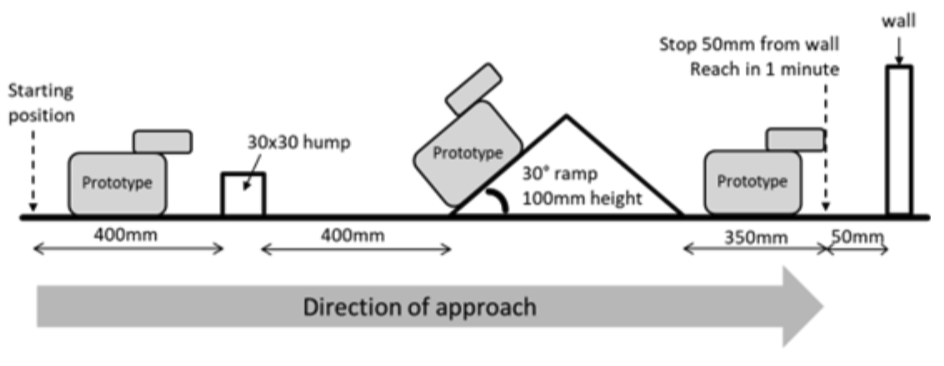

# EG1311 All Terrain Rover

This group project was part of a NUS module titled "EG1311 Design and Make". The aim of the project was to design and construct a rover that can successfully manouvre across the below obstacle course in exactly 1 minute.

The final demo of the rover can be seen here:

](https://www.youtube.com/watch?v=klgijVYz34E)
